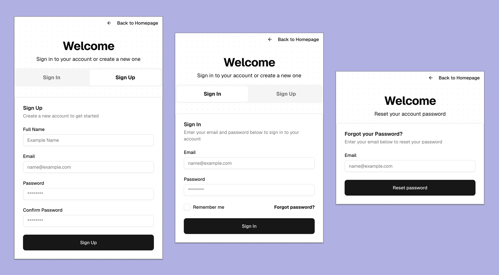

## Better Auth Email/Password authentication with Next.js

<p align="center">
  
</p>

### Tech Stack

- [Next.js](https://nextjs.org/)
- [Better Auth](https://www.better-auth.com/)
- [JSX Email](https://jsx.email/)
- [Tailwind CSS](https://tailwindcss.com/)
- [shadcn/ui](https://ui.shadcn.com/)

### Development

#### Requirements

- Node.js v22
- Docker

#### Setup

```bash
# Install dependencies
npm install

# Create a .env.local file
cp env.example .env.local

# Generate Better Auth secret key and update .env.local
npx @better-auth/cli@latest secret

# Setup Docker container
docker-compose up -d

# Generate the database migration and apply it
npm run db:db:generate
npm run db:migrate

# Push the schema directly to the database (optional)
npm run db:push

# Start the development server
npm run dev
```
